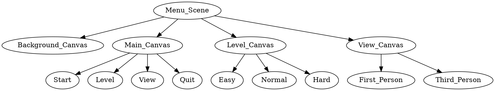
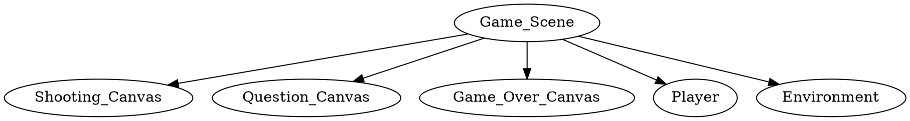

# Math Assault
## Architecture

## Menu Scene
### Main Canvas

### Level Canvas

### View Canvas

* First Person View

* Third Person View

## Game Scene

### Shooting Canvas

### Question Canvas

### Game Over Canvas

## Contents
### Role

### Enemy

### Random Map

### Bullet Shooting

### Skill 1: Special Shooting

### Skill 2: Special Shooting

### Enemy Shooting

### Skill Enhancement Items

## How To Play
1. Role moving: W A S D or Arrow keys
2. The direction the character is facing: Move mouse
3. Bullet shooting: Click left mouse
4. Skill 1: Special Shooting: Q key
5. Skill 2: Special Shooting: E key and hold down the left mouse button 
* The total number of bullets is 3 and will be replenished over time; the total number of lives is 5 and will be replenished over time.
* When shooting to the chariot, a math problem will appear. A math question must be completed within a certain period of time. If the answer is correct, the chariot will disappear. In contrast, if the answer is wrong, it will not disappear. Besides, the faster you answer, the higher your score will be.
* When the total life is 0, the game will be over.